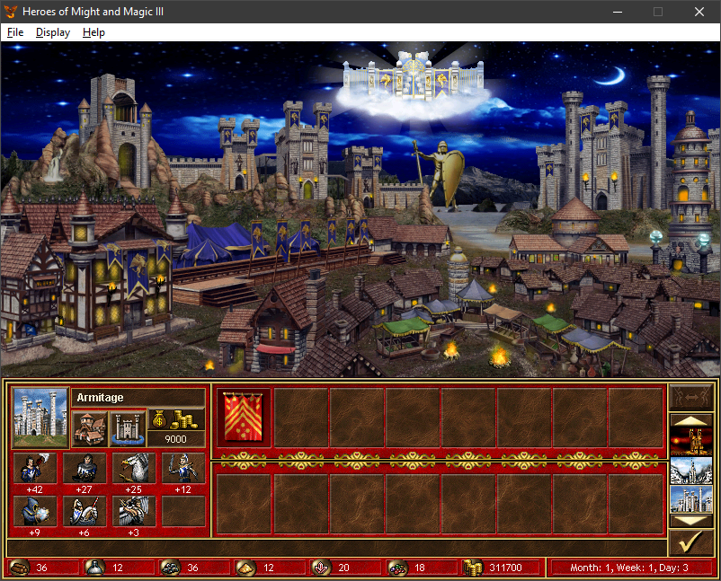
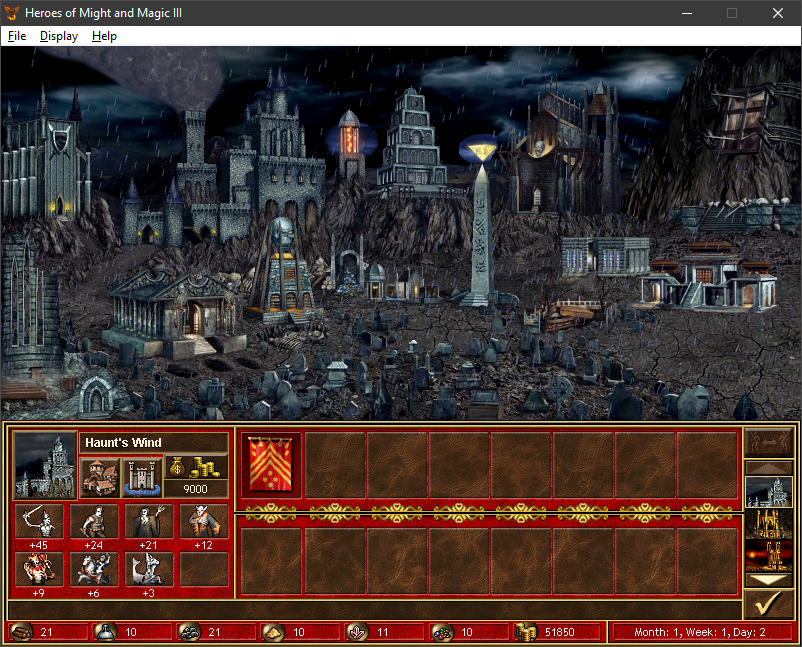
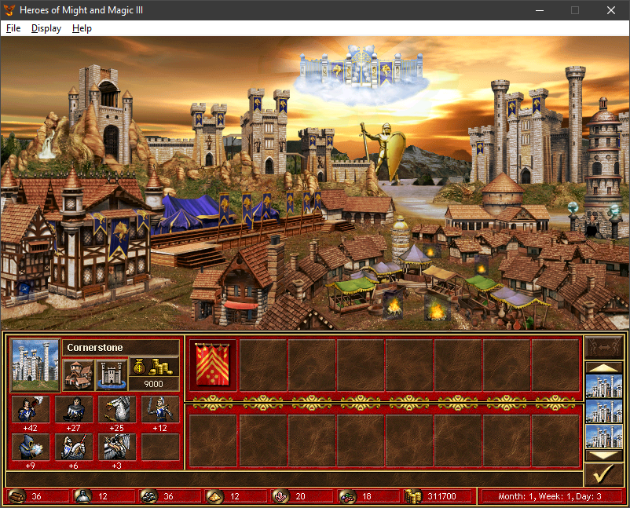

### Mod: **Towns of Day and Night**

---

#### **Overview**

_"Towns of Day and Night"_ brings a whole new level of immersion and realism to **Heroes of Might and Magic III**. With this mod, the cities in your game will dynamically change their appearance depending on the time of day. Whether you're watching the sun rise over a serene Haven or observing the mysterious twilight descending upon a Necropolis, each town will offer a visually distinct experience that deepens your connection with the world.

---

#### **Features**

- **Dynamic Time of Day Visuals**: Towns now shift in appearance as time passes, showcasing beautiful transitions between **dawn**, **daylight**, **dusk**, and **night**.
  
- **Unique Atmospheres for Each Town Type**: Every town type has its own carefully crafted day and night visuals, enhancing their inherent characteristics:
  - **Castles** gleam in the radiant sunlight and take on a warm glow at dusk.
  - **Necropolises** grow darker and more eerie as night falls, shrouded in mystery.
  - **Towers** reflect the changing hues of the sky, from the clear morning to the twilight stars.
  
- **Immersive World-Building**: Experience the game like never before, where each visit to a town feels alive and reactive to the passage of time. Explore cities at dawn with the promise of adventure, or prepare for night-time challenges as the shadows deepen.

- **Seamless Transitions**: The visual changes between times of day are smooth and natural, designed to preserve the aesthetic integrity of the original game while enhancing its atmosphere.

---
#### **Screenshots**

- **Morning in Castle**  
  

- **Night in Necropolis**  
  

- **Dusk in Stronghold**  
  

---

#### **Why This Mod?**

**Heroes III** has long been a favorite for its rich strategy and fantasy elements, but this mod adds a new layer of life to the game. Instead of static town screens, you’ll now get a world that feels more alive and responsive to the time of day. Whether you're building your kingdom under the bright sun or defending your citadel under the cover of darkness, "Towns of Day and Night" offers an unforgettable enhancement to your gameplay.

---

#### **Credits**

- **Idea and Artwork**: **FanOfHeroes**
- **Code and Plugin Development**: **daemon_n**

This mod was made possible thanks to the creative vision of FanOfHeroes and the technical expertise of daemon_n
---
